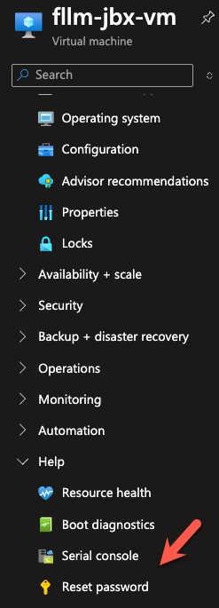
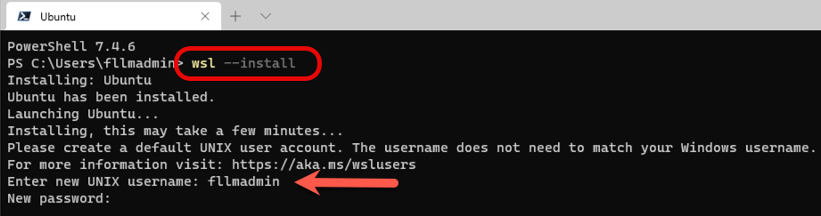

# FoundationaLLM-JBX

Welcome to the **FoundationaLLM-JBX** repository! This project is designed for the deployment of the **FoundationaLLM** product, which is available in a separate repository. To learn more about the FoundationaLLM project, please visit the [FoundationaLLM GitHub repository](https://github.com/solliancenet/FoundationaLLM) and the official documentation at [docs.FoundationaLLM.ai](https://docs.FoundationaLLM.ai/).

- [FoundationaLLM-JBX](#foundationallm-jbx)
  - [Project Overview](#project-overview)
  - [Features](#features)
    - [Prerequisites](#prerequisites)
    - [Installation](#installation)

## Project Overview

FoundationaLLM-JBX is a deployment template designed to streamline the process of setting up and managing the FoundationaLLM environment in Azure. This template is a complementary resource to the main FoundationaLLM project, providing the necessary infrastructure and automation scripts for efficient deployment.

## Features

- **FLLM Installation Jumpbox**: Rapidly deploy a jumpbox environment for installing and configuring the FoundationaLLM product.
- **Tool Installation**: The `Install-FllmJbx.ps1` script automates the installation of essential tools, including:
  - **Azure CLI**: Command-line interface for managing Azure resources.
  - **Azure Developer CLI (azd)**: CLI tool to streamline Azure development.
  - **Azure Storage Explorer**: Tool for managing Azure storage resources.
  - **Chocolatey**: Package manager for Windows.
  - **Docker Desktop**: Containerization platform.
  - **dotnet SDK**: .NET software development kit.
  - **dotnet**: .NET software development framework.
  - **FileZilla**: FTP client.
  - **Git**: Version control system.
  - **Helm**: Kubernetes package manager.
  - **Kubectl**: Command-line tool for interacting with Kubernetes clusters.
  - **Kubelogin**: Tool for logging into Kubernetes clusters on Azure.
  - **Lens**: Kubernetes IDE.
  - **Postman**: API development tool.
  - **PowerShell Core**: Cross-platform task automation tool.
  - **Visual Studio 2022**: Integrated development environment.
  - **Visual Studio Code**: Visual Studio Code editor.
  - **VSCode C# Extension**: C# extension for Visual Studio Code.
  - **VSCode PowerShell Extension**: PowerShell extension for Visual Studio Code.

### Prerequisites

Before you begin, ensure you have met the following requirements:

- [Azure CLI](https://docs.microsoft.com/en-us/cli/azure/install-azure-cli) installed on your machine.
- Sign in to Azure using the Azure CLI by running `az login`.
- Set the subscription you want to use by running `az account set --subscription <subscription-id>`.
- [Git](https://git-scm.com/downloads) installed on your local machine.
- [Powershell Core](https://learn.microsoft.com/powershell/scripting/install/installing-powershell?view=powershell-7.4) installed on your local machine.

### Installation

1. Clone this repository:

   ```bash
   git clone https://github.com/solliancenet/FoundationaLLM-jbx.git
   cd FoundationaLLM-jbx

> **Note:** To deploy the Jumpbox you will need to have an existing Virtual Network. You can use the script `Deploy-JbxVnet.ps1` to create one.

2. Collect the following information:
   - **Resource Group Name**: The name of the resource group where the jumpbox will be deployed.
   - **Location**: The Azure region where the jumpbox will be deployed (e.g., `eastus2`) must be the same region as the Virtual Network.
   - **VNet Name**: The name of the virtual network.
   - **Subnet Name**: The name of the subnet.

> **Note:** 🚨🚀 The following parameters are optional and can be modified in the `Deploy-FllmJbx.ps1` script:

   ```powershell
    [Parameter(Mandatory = $false)][string]$adminUsername = "fllmadmin",
    [Parameter(Mandatory = $false)][string]$location = "eastus2",
    [Parameter(Mandatory = $false)][string]$nsgName = "fllm-jbx-nsg",
    [Parameter(Mandatory = $false)][string]$publicIpName = "fllm-jbx-pip",
    [Parameter(Mandatory = $false)][string]$resourceGroupName = "rg-hub-eastus2-net-fllm",
    [Parameter(Mandatory = $false)][string]$subnetName = "jbx",
    [Parameter(Mandatory = $false)][string]$vmName = "fllm-jbx-vm",
    [Parameter(Mandatory = $false)][string]$vnetName = "vnet-hub-eastus2-net-fllm"
   ```
3. Run the `Deploy-FllmJbx.ps1` script:

   ```powershell
   .\Deploy-FllmJbx.ps1 -resourceGroupName <resource-group-name> -location <azure-region> -vnetName <vnet-name> -subnetName <subnet-name>
   ```
4. Once the deployment is complete, reset the password using the Azure portal.
    
   - Navigate to the Azure portal.
   - Go to the Virtual Machine resource.
   - Click on `Help` then `Reset password` option.
   - Follow the instructions to reset the password.
  


5. To install Windows Subsystem for Linux (WSL) on the jumpbox, run the following command in the PowerShell terminal:

   ```powershell
   wsl --install
   ```

